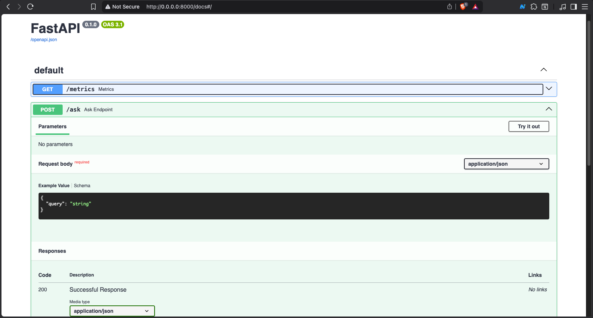

# Self-Hosted Edge RAG Server

This project is a self-hosted Retrieval-Augmented Generation (RAG) server
built to run fully offline on a small x86 edge device such as the
LattePanda 3 Delta.

The goal is to make document-based search and chat possible without
depending on cloud APIs or external services. Everything runs locally,
which makes the system suitable for privacy-sensitive use cases and
environments with limited or unreliable internet access.

## Project Scope

This project focuses on building a reliable, always-on edge server that
can answer questions using local documents. The system includes:

- Ingesting and embedding documents locally
- Retrieving relevant information using vector search
- Generating answers using a locally running language model
- A REST API for querying and managing the system
- Basic system health and resource monitoring
- Deployment on compact, low-power x86 hardware

The emphasis is on **software, infrastructure, and deployment**, rather
than custom hardware design. The server runs on off-the-shelf hardware
without any custom PCB or enclosure work.

## Extensibility

While the core project is the RAG server itself, the system is designed
to be modular. After deployment, the same hardware can optionally be
used to run additional local services, such as:

- Audio transcription and summarization
- A local chat interface using OpenWebUI
- Image generation services
- Automation tools like n8n
- Other containerized microservices

These extensions are optional and are not required to understand or
evaluate the main project.

## Hardware Target

- **Device:** LattePanda 3 Delta (x86 SBC)
- **Operating System:** Ubuntu Server or Debian
- **Memory:** 8–16 GB RAM
- **Storage:** SSD

## Key Goals

- Operate fully offline
- Keep all data local and private
- Be easy to reproduce and deploy
- Maintain clear system boundaries and documentation

## Data Directory

All documents used by the RAG pipeline should be placed inside the
`data/` directory.

This folder is treated as the source of truth for ingestion. Any files
added here will be processed and embedded when the ingestion script is
run.

## How to Run

```bash
git clone <repo-url>
cd self-hosted-edge-rag-server
python -m venv .venv
source .venv/bin/activate
pip install -r requirements.txt
python app/ingest.py
uvicorn app.main:app --host 0.0.0.0 --port 8000
```

## Screenshot


